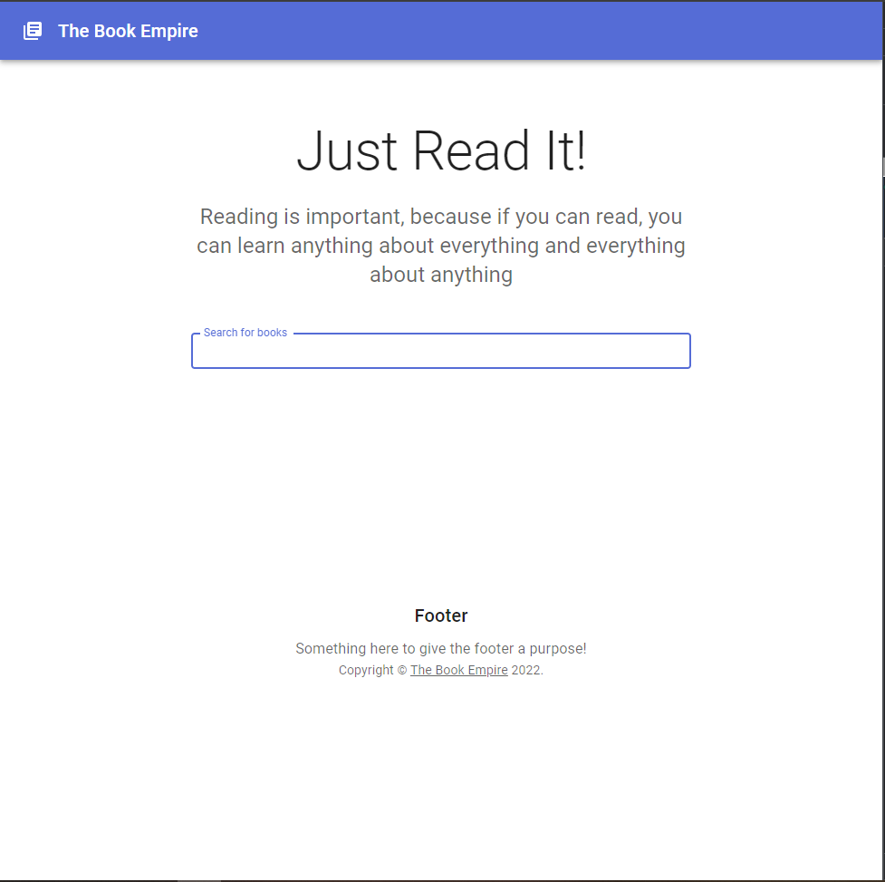

# The Book Empire

### Tehnologies
- Next.js
- Typescript
- Material UI
- react-query
- Google Books API

#### For screenshots check the docs folder




### Install it and run:

```sh
npm install
npm run dev
```


### TODO:

Book List Screen Main Features:

- [x] Display list of books with possibility to search via dedicated text input
- [x] Search method should be triggered only after user finishes typing
- [x] List of books should be displayed in max 4 columns
- [x] Screen should be responsive
- [x] When user clicks on one book, application displays detailed information (next screen)
- [x] When user comes back from an internal URL to current Screen, the application should display latest search text
and books
- Following information should be displayed:
    - [x] Title
    - [x]Thumbnail
    - [x] Subtitle (if available)
    - [ ] Search Info (if available)

Book Detailed Screen Main Features:

- [x] Displays detailed information about a book
- [x] On page refresh, same information should be displayed
- [ ] Possibility to add displayed book to Favorite List
- Following information should be displayed:
    - [x] Title
    - [x] Thumbnail
    - [x] Subtitle (if available)
    - [ ] Search Info (if available)

Favorite List Screen Main Features:
- [ ] Displays list of favorite books marked by user.
- [ ] Screen should look the same as Book List Screen, but without search input
- [ ] If the user saves some books as favorites and then closes the browser/page, then when the user will come back
he should be able to see the list of books that was marked as favorite.